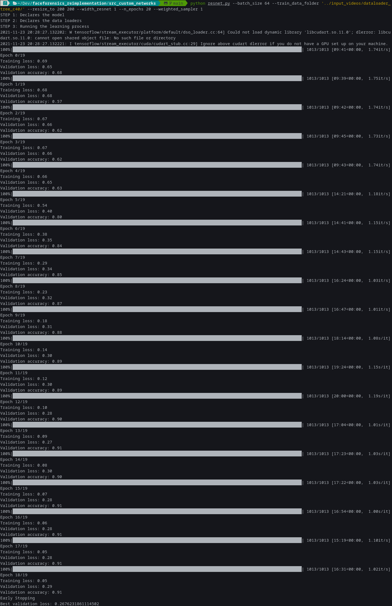
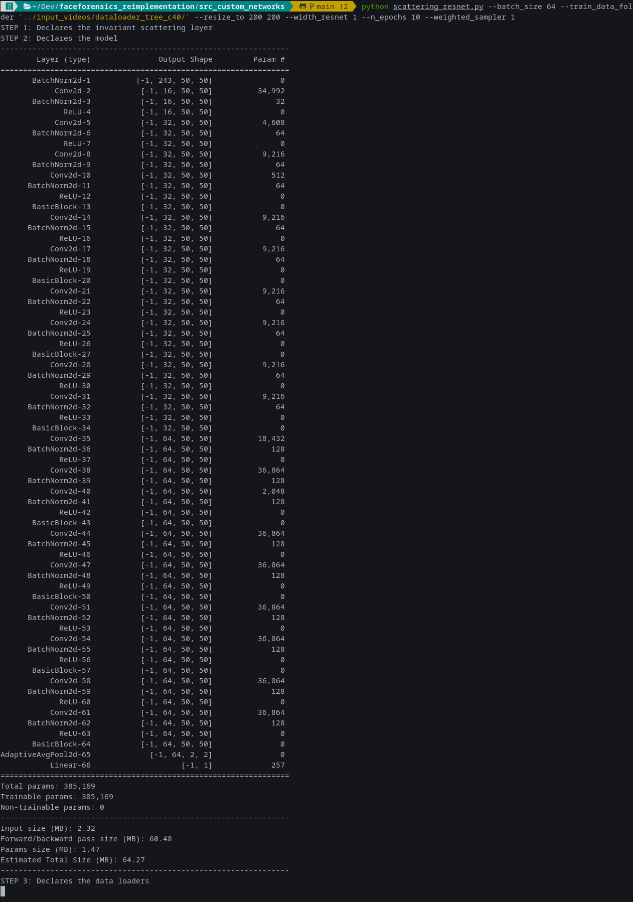

# Content

This is a Python 3.8.x reimplementation of the testing part of the FaceForensics++ code available [here](https://github.com/ondyari/FaceForensics), kindly provided by [Andreas Rössler](https://github.com/ondyari).

This repository also contains an overview presentation of the FaceForensics++ paper based on [Alejandro Serrano](https://github.com/serras)'s [INFOFP 2021 presentation](https://github.com/serras/infofp-2021). 

## Installation

This repository was tested with **Python 3.8.8**. The repository versions used are stored in the ``requirements.txt`` file in the root folder of this repository.

# Guides

## Testing a video

*You can test a video for being a deepfake by running the code provided by the researcher, and updated in this repository, by following these steps*:

1. Download the models at the link [here](http://kaldir.vc.in.tum.de/FaceForensics/models/faceforensics++_models.zip).

2. Extracts the models ``full_c23.p``, ``full_c40.p`` and ``full_raw.p`` from the compressed folder ``faceforensics++_models/faceforensics++_models_subset/full/xception`` into the folder ``input_models``.

3. Move any video to test (in format ``.mp4`` or ``.avi``) at the root of the ``input_videos`` folder (a 480p example taken from [Youtube](https://youtu.be/oxXpB9pSETo) is left there as an example). 

4. Run the following code (you have to modify the script with the target model to use):

```sh
python src_faceforensics/launch_detection.py -i input_videos -m input_models/<model_file> -o output_videos
```

## Training a new neural network

### Constructing a sub-dataset

Because of local limitations (GTX980ti), I decided to work with a subset of the dataset. 

> **idea**: For each available video (whether pristine or fake, given the six available forgery methods), up to 9 random frames are extracted into a dataset of roughly 80,000 images (to be used for given splits between training and validation/testing).

The process goes as follow:

1. Download the FaceForensics++ dataset using the ``download.py`` script (not included in this repository) that you can request from the FF++ team by following the process found [here](https://github.com/ondyari/FaceForensics/tree/master/dataset). Put the script in the folder ``input_videos`` and call the following script (c40 videos weight about 5Gb and at the time of the writing of this repository, the EU2 server was open):

```sh
python download.py . -d all -c <insert_compression_model> -t videos --server <insert_server>
```

2. Extracts random frames using the script ``convert_videos2images.py`` located in the folder ``input_videos``. The images are set in a folder ``images`` at the same file level as the videos they are extracted from. 

```sh
python convert_videos2images.py --compression <insert_compression_model>
```

3. Retrieves the extracted images and set them into a separate subfolder located in the folder ``input_videos``. This subfolder will be used as part of a PyTorch data loader method. 

``sh
python create_data_folder.py --compression <insert_compression_model>
``

**Note**: This part takes a really long time depending as it is iterative video by video (c. 9,000 in total)

### Running a neural network

To run either the ResNet50 or the ResNet50 with Scattering Transform, please refer to the `README.md` file at the root of the folder `src_custom_networks`. Running neural networks yields processes as such:





Current best result is achieved with the ResNet50 with an accuracy of 89% after 10 epochs using a resampling method to deal with the pristine/fake video 1-to-5 imbalance.

# Folder structure

``NI`` means the file or folder is not included in the repository.

```
.
├── README.md
├── requirements.txt
│
├── input_models                 # Folder containing the FF++ pretrained models
│   ├── README.md
│   ├── full_c23.p               # (NI) Xception c23 model 
│   ├── full_c40.p               # (NI) Xception c40 model
│   └── full_raw.p               # (NI) Xception raw model
│
├── input_videos                 # Folder containing the FF++ datasets
│   ├── README.md 
│   ├── convert_videos2images.py # Script to convert manip/orig videos into pics 
│   ├── create_data_folder.py    # Script retrieve a random selection of images to create a data loader 
│   ├── download.py              # (NI) Script to download the FF++ dataset
│   ├── notMorgan.mp4            # Example video
│   ├── dataloader_<compression> # (NI) Folder with a copy of image data for a Pytorch dataloader
│   │   └── ... 	         
│   ├── benchmark                # Contains the 1000 FF++ benchmark pictures
│   │   └── ... 	         # (NI: videos and images)
│   ├── manipulated_sequences    # Contains the manipulated sequences of the FF++ dataset
│   │   └── ... 		 # (NI: videos and images)
│   └── original_sequences       # Contains the original sequences of the FF++ dataset
│       └── ... 		 # (NI: videos and images)
│
├── output_videos                # Folder where to put network-processed videos
│   ├── README.md 
│   └── recombine_audio_video.sh # Shell script to recombine input and output video w/ crossfade
│
├── src_custom_networks          # Source folder for the custom implementation of networks
│   ├── README.md
│   ├── resnet.py                # Call script for a ResNet50 implementation 
│   ├── scattering_resnet.py     # Call script for a ResNet50 implementation with scattering transform layers
│   └── custom_functions         # Folder where the custom network implementation are stored
│       ├── __init__.py 
│       ├── data_loader.py       # Python methods to implement a Torch data loader
│       ├── resnet.py            # Python methods to implement a Torch resnet50
│       └── scattering_resnet.py # Python methods to implement a Torch resnet50 with Scattering transform layers
││
├── src_forensics                # Source folder for all neural network code
│   ├── README.md
│   ├── detect_from_videos.py    # Reimplementation of FF+ test phase with Xception 
│   ├── launch_detection.py      # Script call to streamline the use of detect_from_videos.py
│   └── network                  # Folder where the Xception PyTorch model is declared
│       ├── __init__.py 
│       ├── models.py            # Pytorch methods for transfer model
│       └── xception.py	         # Xception implementation for transfer model
│
├── src_presentation             # Source folder for the presentation
│       ├── README.md
│       ├── slides.html          # Slides to open in a web browser to visualize
│       ├── css                  # CSS methods for the slides
│       │   └── ...
│       ├── images               # Images for the slides
│       │   └── ...
│       └── videos               # Videos for the slides
│           └── ...
│
└── src_report                    # Source folder for my LaTeX notes
    └── ...
```
